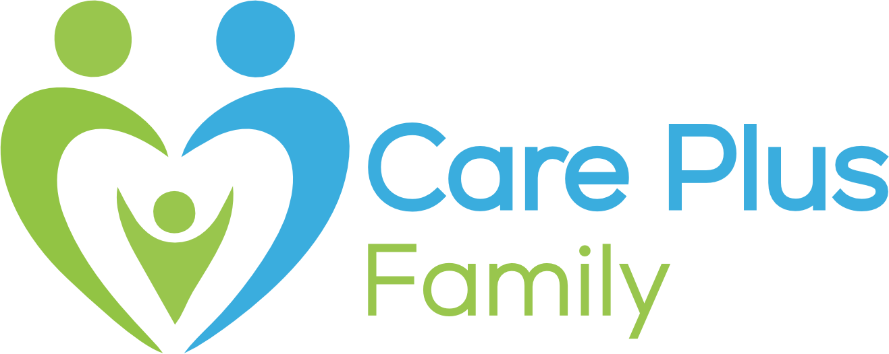
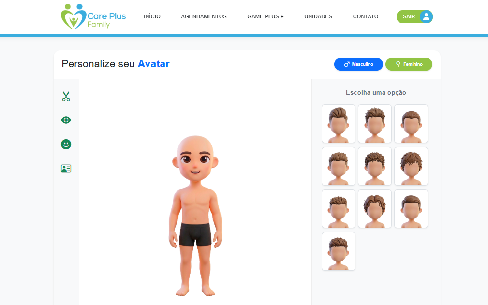
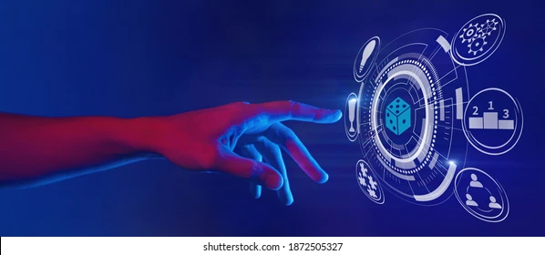
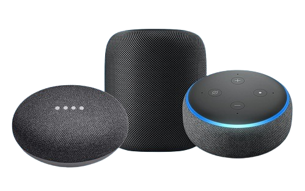

  

  # Care Plus Family
  ### 🌟 Transformando a Saúde Preventiva e Vencendo o Desafio do *No-Show*
  
  

    <strong>Projeto Acadêmico Desenvolvido para o Desafio FIAP (2025 - 2026)</strong>
  

  

    
    
    
    
  

---

## 🎯 Sobre o Projeto & O Desafio FIAP

Entre os anos de **2025 e 2026**, nossa equipe foi desafiada pela **Faculdade FIAP** a idealizar e construir uma solução de alto impacto para solucionar uma das maiores dores da gestão em saúde suplementar: o **No-Show** (o absenteísmo e não comparecimento de pacientes às consultas e exames agendados).

O *No-Show* gera filas desnecessárias, ociosidade na agenda médica e atrasos no diagnóstico preventivo. Para enfrentar esse desafio real, nasceu o **Care Plus Family**. 

Mais do que um simples portal de agendamentos, o **Care Plus Family** reimagina a jornada de saúde do paciente e de seus dependentes através de:
- **Gamificação Positiva (Game Plus +):** Incentivo ao comparecimento com acúmulo de pontos que podem ser trocados por benefícios reais e produtos saudáveis.
- **Engajamento Familiar e Coletivo:** Metas compartilhadas e rankings saudáveis em família e equipes corporativas.
- **Comunicação Ativa e Inteligente:** Integração conceitual com assistentes virtuais de voz para notificações proativas e lembretes amigáveis de consultas.
- **Ecossistema Completo de Gestão:** Painéis integrados para o beneficiário, família e ambiente de RH corporativo.

> ❤️ **Um Trabalho Feito com Dedicação e Carinho:**  
> Este projeto representa centenas de horas de pesquisa, ideação de interfaces e código escrito linha por linha. Foram muitas noites em claro, xícaras de café e uma dedicação incansável de toda a equipe para transformar complexidade em uma experiência fluida, acessível e humana. Cada botão, cada animação e cada sombra translúcida refletem o nosso amor pela tecnologia aplicada ao bem-estar das pessoas.

---

## 📸 Galeria de Telas & Recursos

| Página Inicial & Especialidades | Hub de Monitoramento & Painel |
|:---:|:---:|
|  |  |

| Game Plus + & Gamificação | Integração com Assistente Virtual |
|:---:|:---:|
|  |  |

---

## 💎 Estilo Visual: *Glassmorphism* & Design System

A identidade visual foi pensada para transmitir modernidade, tranquilidade e sensação de cuidado através do estilo **Glassmorphism**:

- 🪟 **Superfícies Translúcidas:** Efeito de vidro jateado (*frosted glass*) gerado via `backdrop-filter: blur()`.
- 🌈 **Bordas Sutis e Delicadas:** Contornos com gradientes finos e transparências que conferem profundidade tridimensional.
- 🎨 **Paleta de Cores Terapêutica:**
  - **Care Plus Blue (`#3AADDE`):** Serenidade, tecnologia e confiança.
  - **Care Plus Green (`#92C444` / `#34D052`):** Vitalidade, saúde e renovação.
  - **Glass Backgrounds:** Tons neutros e luminosos que destacam o conteúdo sem sobrecarregar a visão.
- 📐 **Microinterações e Feedback Visual:** Transições suaves em hover, flip cards e modais dinâmicos.

---

## 🛠️ Tecnologias, Técnicas & Frameworks

O projeto foi planejado com rigor técnico, priorizando performance, manutenibilidade e padrões web modernos:

### 🧩 Front-end & Arquitetura
- **HTML5 Semântico:** Estruturação acessível dividida em **30 páginas completas**.
- **CSS3 Avançado:** 
  - Variáveis CSS nativas (Custom Properties) para temas consistentes.
  - Flexbox e CSS Grid para layouts responsivos em múltiplas resoluções.
  - Animações CSS com `transform`, `keyframes` e transições de estado.
- **JavaScript Moderno (ES6+ Modules):** Lógica desacoplada, imports dinâmicos e controle de estado local.
- **Web Components Nativos (W3C Standard):** 
  - Desenvolvimento orientado a componentes reutilizáveis utilizando `customElements.define()` e templates encapsulados.
  - Mais de 25 componentes próprios criados para navegação, formulários, alertas, gráficos e rankings.
- **Bootstrap 5.3:** Adoção estratégica do grid system e utilitários responsivos em harmonia com componentes customizados.
- **Bootstrap Icons:** Conjunto de ícones leves e escaláveis para ações e navegação intuitiva.

### 🎮 Gamificação & Funcionalidades Principais
- **Criador de Avatar Customizado:** Sistema dinâmico em camadas (olhos, cabelo, roupa e expressão) com persistência visual.
- **Hub de Saúde Preventiva:** Monitoramento diário de Passos, Frequência Cardíaca (BPM), Glicemia, Ingestão de Água e Sono.
- **Gestão de Agendamentos & Fila de Encaixes:** Facilidade para marcar, reagendar ou desistir de horários, permitindo que outros pacientes ocupem as vagas ociosas (combate direto ao No-Show).
- **Ambiente B2B (Corporativo):** Painel para empresas cadastrarem colaboradores, acompanharem metas de saúde do time e gerenciarem desafios.

---

## 🗺️ Mapa do Ecossistema (30 Páginas)

O projeto conta com **30 páginas HTML completas**, organizadas nos seguintes módulos:

### 🌐 Portal Público & Institucional
1. `index.html` — Landing Page principal da Care Plus Family
2. `Odontologia.html` — Apresentação dos tratamentos e cuidados odontológicos
3. `Dermatologia.html` — Especialidades dermatológicas e procedimentos
4. `GamePlus.html` — Apresentação do programa de gamificação e saúde
5. `Unidades.html` — Rede de clínicas, consultórios e endereços credenciados
6. `Contatos.html` — Canais de suporte, ouvidoria e atendimento 24h
7. `NavbarDeslogado.html` — Template isolado da barra pública

### 🔐 Autenticação & Recuperação
8. `Login.html` — Acesso para Beneficiário ou Empresa (com efeito flip card)
9. `Cadastro.html` — Fluxo de cadastro em etapas (wizard multi-step)
10. `EsqueceuSenha.html` — Recuperação segura de credenciais

### 👤 Painel do Beneficiário Logado
11. `HomePageLogado.html` — Dashboard principal com avatar, calendário, carrossel e próximas consultas
12. `Agendamentos.html` — Central de agendamento de consultas médicas e odontológicas
13. `PainelAgendamento.html` — Escolha de especialidade, médico, data e turno
14. `CancelarConsulta.html` — Cancelamento preventivo com liberação de encaixe
15. `EditarPerfil.html` — Gerenciamento dos dados cadastrais e preferências
16. `Avatar.html` — Estúdio de personalização do avatar do usuário
17. `Ranking.html` — Ranking geral de pontuação do Game Plus +
18. `PainelRanking.html` — Detalhes da classificação individual
19. `PainelTarefas.html` — Central de missões e metas diárias de saúde
20. `TrocadePontos.html` — Vitrine de recompensas, vales e benefícios por comparecimento

### 👨‍👩‍👧‍👦 Núcleo Família
21. `AmbienteFamilia.html` — Gestão centralizada dos dependentes
22. `Familia.html` — Cadastro e acompanhamento de membros da família
23. `PainelRankingFamilia.html` — Placar amigável de saúde entre familiares
24. `PainelTarefasFamilia.html` — Metas colaborativas da casa

### 🏢 Núcleo Corporativo (Ambiente Empresa)
25. `HomePageEmpresaLogado.html` — Dashboard do gestor corporativo e equipe
26. `AmbienteEmpresa.html` — Visão geral da saúde dos funcionários
27. `IncluindoEmpresa.html` — Cadastro de novas empresas e filiais
28. `EditarPerfilEmpresa.html` — Configurações do perfil corporativo
29. `RankingEmpresa.html` — Classificação de engajamento entre colaboradores
30. `TarefasEmpresa.html` — Criação e acompanhamento de desafios de bem-estar

---

## 👥 Equipe & Agradecimentos

Este projeto foi construído a muitas mãos, com dedicação incondicional para transformar o aprendizado acadêmico da **FIAP** em uma ferramenta prática com real potencial de impacto social na saúde.

> *"A tecnologia só atinge seu propósito máximo quando é utilizada para cuidar das pessoas."*

  Desenvolvido com todo o carinho para o Desafio FIAP 2025–2026.

